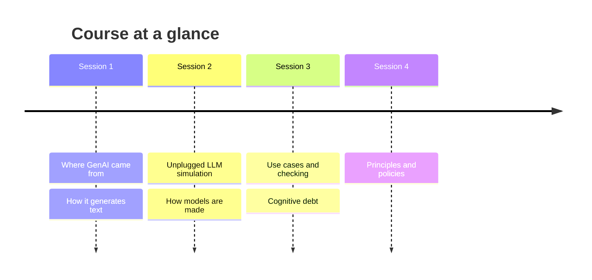
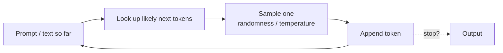
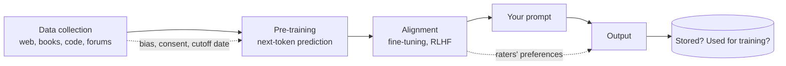
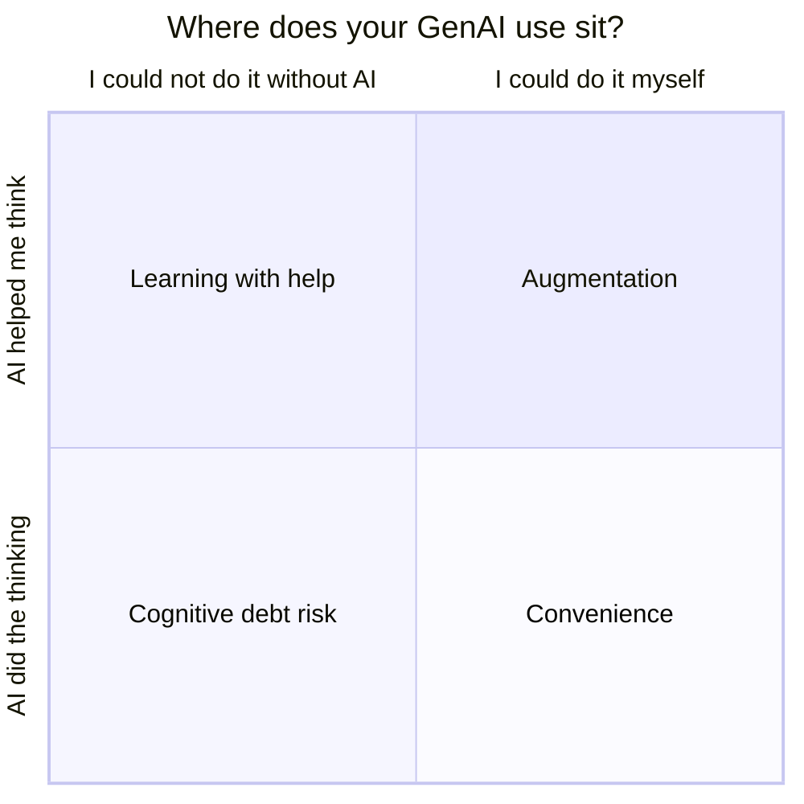
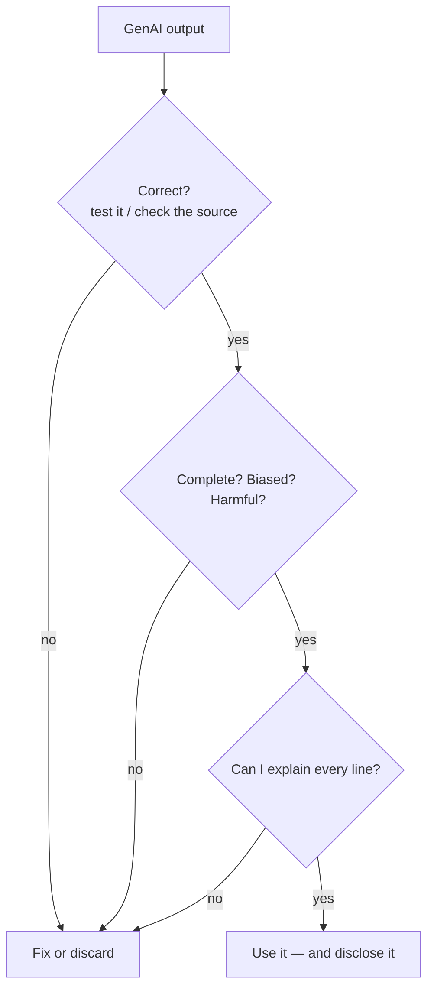
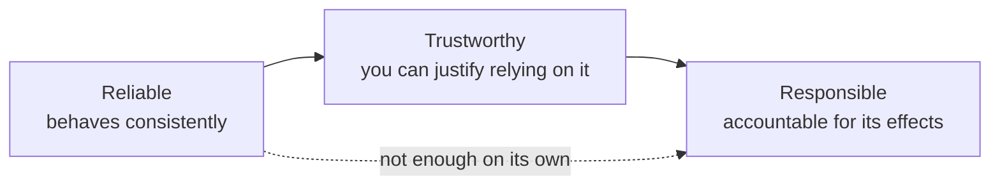
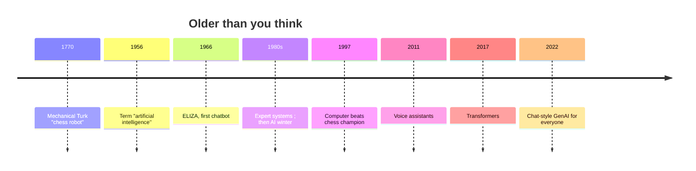
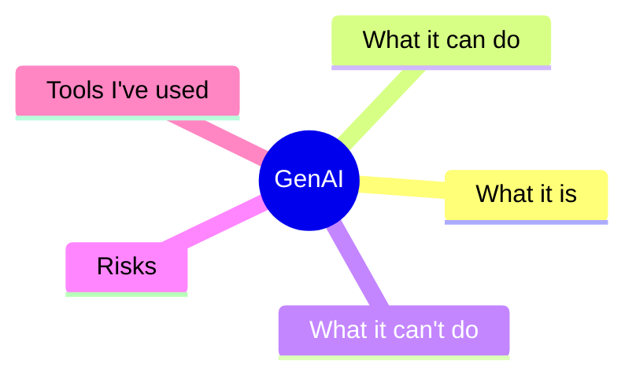

# Visual elements — reference snippets

Use Mermaid (fenced ```mermaid blocks): it renders on GitHub, in VS Code and in most markdown-aware VLEs, needs no tooling, and stays editable. Keep diagrams small (≤ 12 nodes), use default styling (it adapts to light/dark themes), and always follow a diagram with a one-line caption in italics saying what to look at. Every student-facing file should have at least one figure where a concept is structural (a process, a split, a timeline, a decision). Don't decorate: if a table says it better, use the table.

Reuse library figures where they exist (copy into `<course>/figures/`): `learning-activities/activities/figures/xai-decision-tree-example.png` (LA05).

## Course at a glance (overview)


## Next-token generation loop (MM01, CS02 — LA07 handout)


## How a model is made (MM02, EPR02, EPR03 — LA15 or session 2 handout)


## Augmentation vs. substitution (EPR08 — LA12 handout)


## Verify before you use it (CS04a, EPR07 — use-case handout)


## Reliable / trustworthy / responsible (EPR06)


## AI history (H01 — LA01 reveal, post-activity handout)


## Mindmap starter (MM05 — LA10)


## Policy in one picture (EPR04, EPR12 — from a `policy` attachment)
Render the attachment's allowed / not-allowed / always rules as a three-column flowchart or a simple table; quote the policy's own wording in the nodes.
