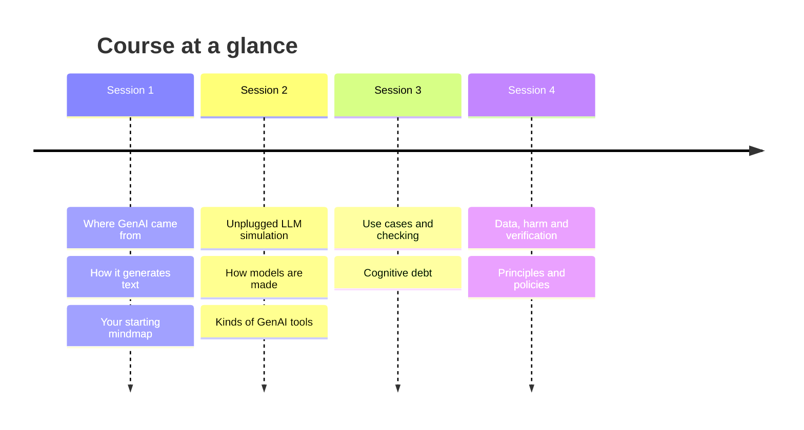
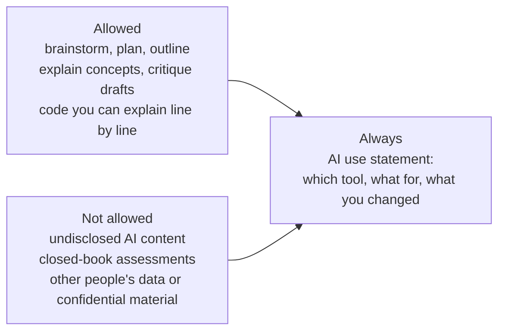

# Generative AI Literacy for Computing Students

**Institution:** Example University · **Instructor:** Dr A. Educator · **Audience:** first-year BSc Computer Science students (~60) · **Delivery:** in-person · **Contact time:** 6 h (4 × 90 min) · **Out-of-class:** 1 h

## About this course

Most of you already use ChatGPT or Copilot. This one-day course is about using them *well*: knowing what is actually happening when a model "answers", where it goes wrong and why, how to check its output before you rely on it, and how to make your own decisions about when GenAI helps you learn and when it quietly does your thinking for you.

We start with where GenAI came from and a hands-on simulation of how a language model produces text. We then put the tools to work on realistic computing tasks and evaluate what comes back. The final session turns to responsibility: the data behind these systems, cognitive debt, and how real policies — including the University's own — judge whether a GenAI use is acceptable.

By the end you will have a personal picture of how your own GenAI habits have changed over the day, a set of principles you helped write, and a clear understanding of what the University expects when you use these tools in your studies.

## Intended learning outcomes

At the end of the course, students should be able to …

| ID | Outcome |
|----|---------|
| H01 | … identify key milestones (e.g. symbolic AI, rule-based systems, machine learning, transformers, …) in AI history and explain why the field experienced periods of rapid advancement and decline (AI winters) |
| H02 | … distinguish between earlier applications of AI (e.g., search algorithms and engines, recommendation systems, navigation systems) and GenAI |
| MM01 | … explain how GenAI models generate output using a simplified "next-word prediction" process, recognising that real systems predict tokens and use contextual information from prompts and prior text to determine their responses. |
| MM02 | … explain, in high-level terms, the GenAI model development process, including data collection, pre-training, and alignment methods such as fine-tuning and RLHF, as well as limitations associated with these processes (e.g., biases related with data collection, dataset cutoff dates). |
| MM03 | … evaluate technical, ethical and practical limitations of GenAI systems (e.g. hallucinations, computational cost, context window, lack of true understanding, biases, …) |
| MM04 | … identify potential GenAI use cases, such as summarisation, augmented reasoning, generating content, evaluating content, ideation, and role playing, whilst recognising that these systems might make occasional mistakes. |
| MM05 | … analyze existing misconceptions about GenAI, distinguishing between its actual capabilities and common myths / misinterpretations. |
| MM06 | … evaluate whether GenAI is appropriate for use in specific scenarios, based on ethical, practical, and task-related considerations. |
| EPR02 | … identify data sources used to train GenAI models and describe how training data quality, consent, and representation shape GenAI model behaviors. |
| EPR03 | … evaluate data management in GenAI systems in order to identify risks of misuse, manipulation, and threats to data sovereignty. |
| EPR04 | … explain the shortcomings of GenAI outputs (e.g. accuracy, reliability) and recognise the need to follow the appropriate policies and regulations within the context where the outputs will be used. |
| EPR05 | … recognize limitations in GenAI model outputs, including hallucination, misinformation, privacy leakage, harmful content, in the context of societal impacts. |
| EPR06 | … differentiate between reliable, trustworthy, and responsible GenAI systems. |
| EPR07 | … identify tools and procedures for evaluating and verifying model outputs, and apply these to assess AI-generated content. |
| EPR08 | … explain how overreliance on GenAI can lead to cognitive debt. |
| EPR10 | … evaluate (the use of) GenAI systems against relevant normative principles (e.g., fairness, transparency, accountability, safety, robustness, and human governance). |
| EPR11 | … design a plan for the responsible and context-appropriate use of GenAI, including documenting of GenAI-related outputs and decisions |
| EPR12 | … identify and interpret relevant GenAI policies, assessing their applicability to and impacts on GenAI use in different contexts. |
| EPR13 | … discuss societal perceptions of and expectations around GenAI use, taking into consideration power dynamics in the adoption of GenAI tools. |
| EPR14 | … discuss frameworks for the fair and responsible use of GenAI in the student's particular discipline. |
| CS01 | … distinguish between different types of GenAI systems (e.g., web-based chatbots, coding assistants, local vs cloud-hosted models) and apply this knowledge to select an appropriate system for specific contexts. |
| CS02 | … explain operational GenAI concepts (e.g., tokens, context windows, probability distributions, and non-determinism) and use these concepts to interpret system behavior, output variability, and prompt sensitivity. |
| CS03 | … compare open-source and proprietary GenAI models and identify their main advantages and disadvantages for a given context, for example in terms of data privacy. |
| CS04a | … demonstrate the understanding of the need to verify and review GenAI outputs for correctness, completeness, bias, and potential harm before integrating them into a final solution. |
| CS04b | … explain limitations of GenAI verification arising from non-determinism, incomplete model transparency, and probabilistic output generation. |

## Schedule

*Four 90-minute sessions; homework sits between sessions 2 and 3, and after session 4.*

| # | Session | Topic area | Presentation | Activities | Total | Homework |
|---|---------|------------|--------------|------------|-------|----------|
| 1 | [Where GenAI came from, and how it works](sessions/01-where-genai-came-from.md) | H, MM | 55 min | 35 min | 90 min | — |
| 2 | [Inside the model](sessions/02-inside-the-model.md) | MM, CS | 45 min | 45 min | 90 min | 45 min (before session 3) |
| 3 | [Putting GenAI to work — and checking it](sessions/03-putting-genai-to-work.md) | MM, CS, EPR | 20 min | 70 min | 90 min | — |
| 4 | [Responsibility, policy and you](sessions/04-responsibility-policy-and-you.md) | EPR | 25 min | 65 min | 90 min | 15 min (after session 4) |
| | **Total** | | **145 min** | **215 min** | **360 min** | **60 min** |

Configured split was 144 / 216 (40 %); blocks are rounded to 5 minutes, so the built split is 145 / 215.

## Policies on GenAI use

This course follows the **Example University Policy on Student Use of Generative AI**. The rules that matter most for your work here:

- You **may** use GenAI to brainstorm, plan and outline; to get concepts explained and drafts critiqued; and to generate code — *"provided the student can explain every line submitted"*.
- You **may not** submit GenAI-generated content as your own without disclosure, use GenAI where an assessment brief forbids it, or upload other people's personal data, confidential material or unpublished research to a GenAI tool.
- Any submitted work that used GenAI must carry an **AI use statement**: *"which tool(s), for what purpose, and what the student changed"*. No statement = you are asserting no GenAI was used.
- You remain responsible for what you submit: *"'The AI said so' is not a defence."*
- Use free consumer tools (e.g. ChatGPT free tier) only with non-sensitive material; for University data use only approved tools (GitHub Copilot via the University licence is approved).

*The University policy in one picture: the AI use statement is the non-negotiable.*

Every activity in this course where you use a GenAI tool starts with a short **policy check** so this becomes a habit rather than a rule you look up later. The full policy is in `course-resources/example-university-genai-policy.md`.

## Assessment

Assessment is **formative only** — nothing here counts towards a grade. It covers the Mental Models outcomes (MM01–MM06) and the "GenAI use and responsibility" outcomes EPR08, EPR10 and EPR11, using short quizzes and reflections. Two pieces come from the activities themselves: the evaluation grid your group completes in session 4, and your revised mindmap after the course. All items are in [`assessment/formative-items.md`](assessment/formative-items.md).

## Reading and resources

- Example University, *Policy on Student Use of Generative AI* (`course-resources/example-university-genai-policy.md`) — read before session 3.
- OECD, *AI Principles* — <https://www.oecd.org/en/topics/sub-issues/ai-principles.html> — used as one of the policy lenses in session 4.
- Optional: the *AI History Timeline* expanded activity notes — <https://docs.google.com/document/d/1_l-GA_432BFovrtk_5Yj1o6kry0Enl-Uf0ndprU22ss/edit?tab=t.0>
