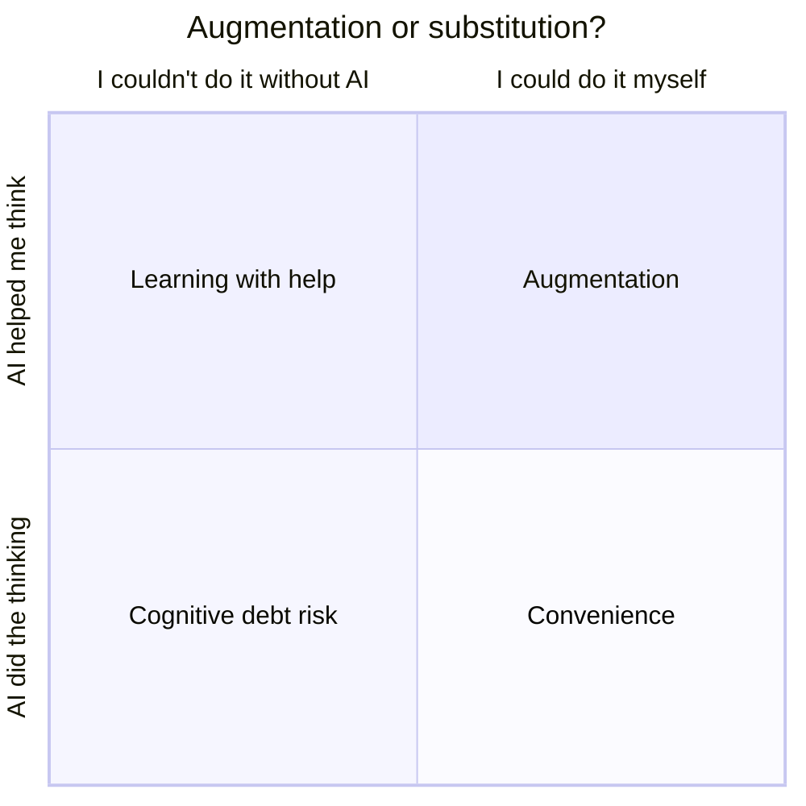

# H1 — My GenAI week (homework before Session 3, ~20 min)

*Pre-sessional part of "Personal AI Use Reflection". Bring this sheet to session 3.*

**1. Log your GenAI use over the past week or two.**

| Tool | Task | How often | Augmentation or substitution?* | What did I skip doing myself? |
|------|------|-----------|-------------------------------|-------------------------------|
| | | | | |
| | | | | |
| | | | | |
| | | | | |

\* **Augmentation** = the AI helped me think or learn (e.g. explained a concept I then understood). **Substitution** = the AI did the thinking for me (e.g. wrote code I submitted without understanding it).

**Where does each use sit?**

*Place each row of your log in a quadrant. Bottom-left is where cognitive debt builds: you can't do it without the tool, and the tool did the thinking.*

**2. Reflection questions**
- Which tasks would I find hard to do now without AI?
- When did AI save me effort, and when did it do the thinking for me?
- Are there skills (writing, debugging, summarising, planning) I practise less than I used to?

**3. Cognitive debt** — Pick one or two areas where you might be building up cognitive debt. What skill is it, what is the tool doing instead of you, and when would you notice?

________________________________________________________________________
