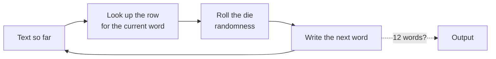
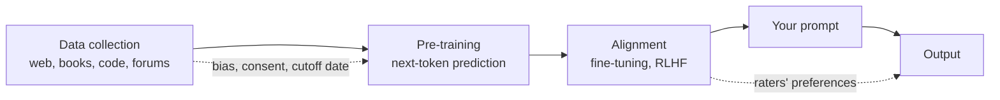

# W1 — n-gram table (Session 2, Unplugged LLM Simulation)

**Group:** ______ **Genre of your training page:** ______________

For each word in the left column, list every word that follows it in your training page and how many times. Then convert the counts into ranges on a six-sided die (share the six faces in proportion; if a word has fewer than six followers, give the common ones more faces).

| Current word | Following words (count) | Die ranges |
|--------------|-------------------------|------------|
| the | | |
| system | | |
| a | | |
| of | | |
| is | | |
| and | | |
| to | | |
| *(add rows as needed)* | | |

**What you are simulating**

*Your page is the training data, your table is what the model learned, the die is sampling. A real model does this with tokens, billions of parameters and a context of thousands of words, but the loop is the same.*

**Prompt (same for everyone):** `The system`

**Generating:** start from the last word of the prompt. Roll the die, find the range, write the word. That word is now the current word. Stop at 12 words or when you reach a word with no row.

| Run | Output |
|-----|--------|
| 1 | The system |
| 2 | The system |
| 3 | The system |

**The real thing, for step 5**

*Which box did each part of the simulation stand for?*

**Mapping (step 5):** training page → ______ · the word you look up → ______ · the table → ______ · the die → ______
