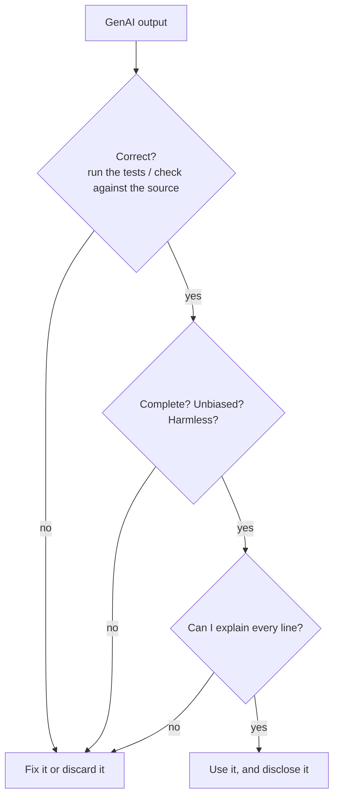

# W2 — Use-case reflection form (Session 3)

**Name:** ______ **Tool used:** ChatGPT (free) / GitHub Copilot **Order:** A→B / B→A

**Policy check (tick):** ☐ No personal data of others in my prompts ☐ Nothing confidential ☐ I will write an AI use statement below

**Before you rate anything, run the output through this:**

*"Can I explain every line" is the University policy's own test for AI-generated code.*

Complete one column per use case.

| | Use case A — write code (student-ID validator) | Use case B — summarise the University GenAI policy |
|---|---|---|
| Correctness and quality of the output (did you test / check it?) | | |
| Problems found: factual errors · omissions · unsupported assumptions · biased framing · security flaws · potentially harmful consequences | | |
| Added value of using the tool for this task | | |
| Was it **appropriate** to use GenAI here? Consider ethics (whose data / work), practicality (could you verify it?) and the task (does the value come from you doing it?) | | |

**AI use statement** (as required by the University policy: which tool, for what purpose, what you changed):

________________________________________________________________________
