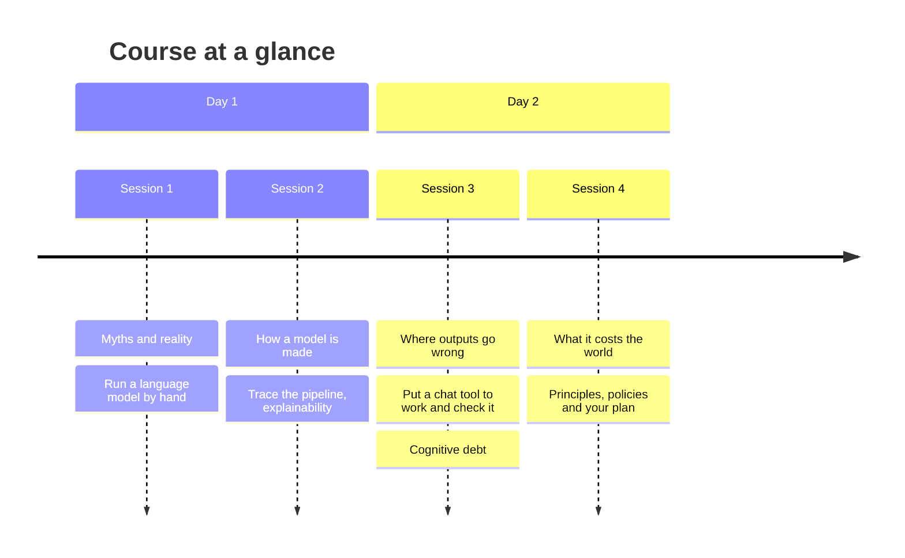

# Generative AI Literacy for CS1

**Institution:** — · **Instructor:** — · **Audience:** first-year computing students taking their first programming course (CS1) · **Delivery:** online (video call with breakout rooms) · **Contact time:** 6 h (4 × 90 min over two days) · **Out-of-class:** 0 h

## About this course

You have probably heard a lot about generative AI. Maybe you have typed a question into ChatGPT or a similar tool, maybe you have mostly watched other people do it. Either way, these tools are now part of how software gets written, and you are about to spend the next few years learning to write software. This two-day course gives you an honest, practical picture of what these systems are, so that you can decide for yourself when they help you learn and when they quietly stop you from learning.

Over two online mornings you will run a language model by hand with pen, paper and a random number, trace how a model is built from data to answer, put a chat tool to work on a small programming task and check whether it got it right, and dig into what it costs the world to build and run these systems. Along the way you will learn the vocabulary people use to argue about AI, from hallucination to alignment to policy, and you will leave with a plan for using these tools in a way that keeps you learning.

By the end you will be able to explain in plain words how a chat model produces its text, spot the common myths, verify what it gives you before you rely on it, describe the data, resources and human labour behind it, and read the policies that apply to you as a student and future professional.

## Intended learning outcomes

At the end of the course, students should be able to …

| ID | Outcome |
|----|---------|
| MM01 | explain how GenAI models generate output using a simplified "next-word prediction" process, recognising that real systems predict tokens and use contextual information from prompts and prior text to determine their responses. |
| MM02 | explain, in high-level terms, the GenAI model development process, including data collection, pre-training, and alignment methods such as fine-tuning and RLHF, as well as limitations associated with these processes (e.g., biases related with data collection, dataset cutoff dates). |
| MM03 | evaluate technical, ethical and practical limitations of GenAI systems (e.g. hallucinations, computational cost, context window, lack of true understanding, biases, …) |
| MM04 | identify potential GenAI use cases, such as summarisation, augmented reasoning, generating content, evaluating content, ideation, and role playing, whilst recognising that these systems might make occasional mistakes. |
| MM05 | analyze existing misconceptions about GenAI, distinguishing between its actual capabilities and common myths / misinterpretations. |
| MM06 | evaluate whether GenAI is appropriate for use in specific scenarios, based on ethical, practical, and task-related considerations. |
| MM07 | articulate what explainability means in AI (i.e., XAI) and how it can improve user's trust when dealing with AI systems. |
| MM08 | discuss the limitations of explainability in GenAI, including why outputs can be difficult to interpret, and identify strategies to assess the model's responses (e.g., fact-checking against trusted sources and cross-checking outputs with alternative prompts) despite limited transparency. |
| EPR01 | understand the origins of resources (e.g. water, minerals, human labor) required to train, deploy, and host large-scale AI models |
| EPR02 | identify data sources used to train GenAI models and describe how training data quality, consent, and representation shape GenAI model behaviors. |
| EPR03 | evaluate data management in GenAI systems in order to identify risks of misuse, manipulation, and threats to data sovereignty. |
| EPR04 | explain the shortcomings of GenAI outputs (e.g. accuracy, reliability) and recognise the need to follow the appropriate policies and regulations within the context where the outputs will be used. |
| EPR05 | recognize limitations in GenAI model outputs, including hallucination, misinformation, privacy leakage, harmful content, in the context of societal impacts. |
| EPR06 | differentiate between reliable, trustworthy, and responsible GenAI systems. |
| EPR07 | identify tools and procedures for evaluating and verifying model outputs, and apply these to assess AI-generated content. |
| EPR08 | explain how overreliance on GenAI can lead to cognitive debt. |
| EPR09 | analyze the effects of GenAI automation on human labor, workplace expectations, and the labor market. |
| EPR10 | evaluate (the use of) GenAI systems against relevant normative principles (e.g., fairness, transparency, accountability, safety, robustness, and human governance). |
| EPR11 | design a plan for the responsible and context-appropriate use of GenAI, including documenting of GenAI-related outputs and decisions |
| EPR12 | identify and interpret relevant GenAI policies, assessing their applicability to and impacts on GenAI use in different contexts. |
| EPR13 | discuss societal perceptions of and expectations around GenAI use, taking into consideration power dynamics in the adoption of GenAI tools. |
| EPR14 | discuss frameworks for the fair and responsible use of GenAI in the student's particular discipline. |

## Schedule

*Two online days, two 90-minute sessions each, with a break between sessions.*

| # | Session | Topic area | Presentation | Activities | Total | Homework |
|---|---------|------------|--------------|------------|-------|----------|
| 1 | What generative AI is, and how it writes | Mental Models | 45 min | 45 min | 90 min | 0 |
| 2 | How a model is made, and what that means for your data | Mental Models · Ethics, Policy and Regulations | 45 min | 45 min | 90 min | 0 |
| 3 | Where outputs go wrong, and how to use AI without losing your skills | Mental Models · Ethics, Policy and Regulations | 40 min | 50 min | 90 min | 0 |
| 4 | What it costs the world, and the rules that apply to you | Ethics, Policy and Regulations | 50 min | 40 min | 90 min | 0 |
| | **Total** | | **180 min** | **180 min** | **360 min** | **0 min** |

Sessions 1 and 2 run on day 1, sessions 3 and 4 on day 2. Plan a 15–30 minute break between the two sessions of each day.

## Policies on GenAI use

No institutional policy was attached to this course. Default expectation: wherever you use a generative AI tool for coursework, say so, say which tool, and follow your institution's rules on academic integrity. If your institution has a GenAI policy, your instructor will tell you where to find it and the course will be updated to reflect it.

In this course you will use only the **free tiers of chat tools** such as ChatGPT, Gemini, Claude or Copilot. No paid account is required. You will be asked to create one free account before day 2 (see session 2 notes); if you prefer not to, you can work alongside a partner who has one.

## Assessment

This course uses **formative, ungraded checks** only. There are two short quizzes, one at the end of each day, run as live polls or a shared form, and a handful of short reflection prompts inside the activities and at the close of day 2. Every item is tagged with the learning outcome it checks so you can see what you have understood and what to revisit. The items are in [`assessment/formative-checks.md`](assessment/formative-checks.md). Two activities also carry their own built-in formative check: the model pipeline worksheet in session 2 and the resource-tracing summary in session 4.

## Reading and resources

No reading list was attached. The activities in this course build on the following sources, which are cited in the activity library and are suitable further reading:

- Crawford, K. and Joler, V. (2018). *Anatomy of an AI System*. The map that inspired session 4's resource-tracing activity.
- The ITiCSE 2026 Working Group 11 intended learning outcomes and activity library, from which every outcome and activity in this course is taken.

---

*Built with the [GenAI Course Configurator](https://github.com/iticse26-wg11/configurator) by ITiCSE 2026 Working Group 11.*
