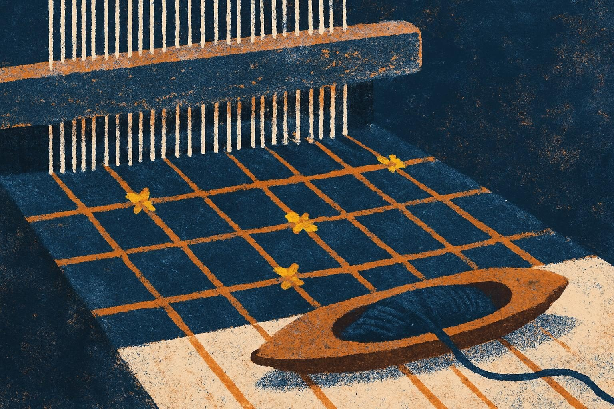

# Coverage report

Generated 2026-09-05 from `config/config.yaml` (status at build: configured; libraries: intended-learning-outcomes @ d8334cc, learning-activities @ b1db0eb).

## Selected ILOs

Topics MM and EPR, all sub-topics, no exclusions: 22 ILOs.

| ILO | Taught (session) | Practised (activity) | Assessed (item) |
|-----|------------------|----------------------|-----------------|
| MM01 | S1 | LA07 (adapted: online) | quiz Q1 |
| MM02 | S2 | LA15 (adapted: online) | quiz Q5, Q6; LA15 built-in worksheet |
| MM03 | S1 | — presentation only (only library activity, LA09, needs Colab + Python and 2 h; excluded by tools and budget) | quiz Q3, Q10 |
| MM04 | S3 | LA13 (adapted: condensed, pairs) | quiz Q13 |
| MM05 | S1 | — presentation only with live chat mini-mindmap (LA10 considered; activity budget exhausted) | quiz Q2, Q10 |
| MM06 | S3 | LA13 (adapted) | reflection R1 |
| MM07 | S2 | — presentation only (LA05 needs 60–90 min for one ILO; budget) | quiz Q8 |
| MM08 | S2 | — presentation only (LA06 needs 60 min; budget) | quiz Q9 |
| EPR01 | S4 | LA08 (adapted: condensed, online) | quiz Q16; LA08 built-in check |
| EPR02 | S2 (also drawn out in S1 debrief) | LA07 (adapted) | quiz Q4 |
| EPR03 | S2 | LA15 (adapted) | quiz Q7; LA15 built-in worksheet |
| EPR04 | S3 | — presentation only (LA03 needs 60 min, overlaps LA13 mechanic; budget) | quiz Q12 |
| EPR05 | S3 | — presentation only (LA09 excluded by tools and budget) | quiz Q11 |
| EPR06 | S3 | — presentation only (LA06 needs 60 min; budget) | quiz Q15 |
| EPR07 | S3 | — presentation only; verification toolkit applied inside LA13 steps 2–3 (LA02 needs a custom knowledge base and 60–90 min; budget and tools) | quiz Q14 |
| EPR08 | S3 | LA12 (adapted: assignment variant) | reflection R2 |
| EPR09 | S4 | LA08 (adapted) | quiz Q17; LA08 built-in check |
| EPR10 | S4 | — presentation only with chat rating exercise (LA11 needs 90 min; budget) | reflection R3 |
| EPR11 | S4 | — guided individual plan-writing (LA04 needs 2 h; budget) | reflection R4 with rubric |
| EPR12 | S4 | — presentation only (LA11; budget) | quiz Q18 |
| EPR13 | S4 | — presentation only (LA04; budget) | reflection R5 |
| EPR14 | S4 | — presentation only (LA04; budget) | reflection R6 |

Summary: 9 ILOs are practised in a library activity (MM01, MM02, MM04, MM06, EPR01, EPR02, EPR03, EPR08, EPR09); 13 are presentation-only, as forecast at configuration time. Every ILO has at least one formative assessment item.

## Not included

- No ILOs excluded within the selected topics (`exclude_ilos` empty).
- Topics not selected: **H** (H01, H02) and **CS** (CS01, CS02, CS03, CS04a, CS04b, CS05, CS06, CS07). CS02, CS04a and CS04b appear in the `related_ilos` of activities used here (LA07, LA13) but are not taught or assessed.

## Adaptations and generated material

| Item | Change | Why |
|---|---|---|
| LA07 Unplugged LLM Simulation (S1, 45 min) | Moved online: paper and dice → one shared document per breakout room and an online random-number generator; instructor pre-fills six of ten table rows. Duration unchanged. | Course is fully online; the source is unplugged and in-class. Core mechanic (die-driven sampling from a hand-built table, same prompt across different training texts) survives intact. |
| LA15 AI Model Pipeline (S2, 45 min) | Moved online: worksheet → shared document per room, content supplied in the handout. Duration unchanged. Built-in formative assessment kept. | Online delivery. |
| LA13 AI Use Case Analysis and Evaluation (S3, 35 min) | Condensed from 2–4 use cases × 20 min + 30 min discussion to 1 use case (20 min) + 15 min discussion. Individual → pairs. Paper/form → shared class form. | Activity budget (180 min for 22 ILOs). One use case keeps the mechanic: real task, real tool, documented observations against fixed criteria, appropriateness discussion. Pairs so that one free account suffices and students with little experience are not alone. |
| LA12 Personal AI Use Reflection (S3, 15 min) | Source's own **assignment variant** used: reflect on the LA13 task instead of a 20-min pre-sessional inventory of general habits. Individual step reduced to 4 min in class. | No out-of-class time configured (homework 0 h); students have little prior GenAI use to inventory. The variant is offered by the source itself. |
| LA08 Anatomy of (Another) AI System (S4, 40 min) | Condensed 60 → 40 min (20 research, 5 summary, 15 share). Poster paper → shared slide with a four-box template. Built-in formative assessment kept. | Activity budget; online delivery. Mechanic (research a real system's material, labour and data demands with at least one estimated quantity, whole-class synthesis) survives. |
| Generated material | None. The S4 responsible-use plan (EPR11) and the S4 chat rating exercise (EPR10) are interactive parts of presentation blocks, counted as presentation time, not as activities. | — |

## Activities considered but not used

| Id | Name | Reason |
|---|---|---|
| LA01 | AI History Timeline | Topic H not selected. |
| LA02 | Content Detection Limitations | EPR07; 60–90 min for one selected ILO and requires a custom GPT or knowledge base, which free tiers do not reliably offer. Budget and tools. |
| LA03 | Basic LLM Output Evaluation and Fact Checking | EPR04; 60 min for one selected ILO, and its mechanic (prompt two tools, compare, check against a policy) is largely exercised inside the condensed LA13. Budget. |
| LA04 | AI Application Project | EPR11, EPR13, EPR14 (+CS07 not selected); 2 h. Budget. Its reflection questions informed the S4 plan-writing prompts. |
| LA05 | Designing an Explainable AI System | MM07; 60–90 min for one ILO. Budget. Its decision-tree example is used as the presentation figure for MM07 in S2. |
| LA06 | LLM Output-Checking: Inductive Explainability Pipeline | MM08, EPR06; 60 min. Budget (ranked below LA07, LA15, LA13, LA08 on ILOs per minute after constraints). ~1 h prep would also have applied. |
| LA09 | AI Alignment Lab | MM03, EPR05; 2 h, requires Google Colab, a 7B model and introductory Python. Excluded by `tools_available` (free chat tools only) and by audience (CS1, little experience), then budget. |
| LA10 | AI Pre/Post Mindmap | MM05; 50 min across first and last session. Budget: the final 40 min went to LA08 (two EPR ILOs) to balance topic time. A 3-minute live chat mini-mindmap in S1 opening preserves the "surface beliefs first" idea without counting as an activity. |
| LA11 | AI Evaluation Frameworks + Policies | EPR10, EPR12; 90 min. Budget. Its principle list and "who wrote the policy" closing questions are used in the S4 presentation block. |
| LA14 | Application of AI to Specific Problem | Topic CS not selected. |

## Attachments

None attached. Default GenAI disclosure statement used in `00-overview.md`; "your institution's rules" used as a placeholder in session 4 and the LA13 policy-check step.

## Time reconciliation

| | Contact | Presentation | Activities | Homework |
|---|---|---|---|---|
| Configured | 360 min (6 h) | 180 min (50 %) | 180 min | 0 min |
| Built | 360 min (4 × 90) | 180 min (S1 45 + S2 45 + S3 40 + S4 50) | 180 min (S1 45 + S2 45 + S3 35+15 + S4 40) | 0 min |
| Difference | 0 | 0 | 0 | 0 |

Per-topic activity time (targets 90 / 90 with equal weights): MM 80 min (½ LA07 + ½ LA15 + LA13), EPR 100 min (½ LA07 + ½ LA15 + LA12 + LA08). The 10-minute tilt toward EPR is the cost of taking LA08 (two EPR ILOs) rather than LA10 (one MM ILO) for the last activity slot; presentation time tilts the other way (MM ≈ 95 min, EPR ≈ 85 min), so total time per topic is within 5 minutes of equal.
