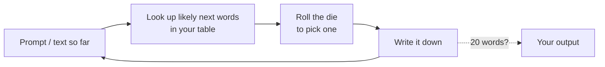

# Session 1: What generative AI is, and how it writes

**Topic area:** Mental Models · **Duration:** 90 min (45 presentation + 45 activities) · **ILOs:** MM01, MM03, MM05 (EPR02 practised, taught in session 2)

## Learning outcomes for this session

| ID | Outcome (exact wording) |
|----|-------------------------|
| MM01 | explain how GenAI models generate output using a simplified "next-word prediction" process, recognising that real systems predict tokens and use contextual information from prompts and prior text to determine their responses. |
| MM03 | evaluate technical, ethical and practical limitations of GenAI systems (e.g. hallucinations, computational cost, context window, lack of true understanding, biases, …) |
| MM05 | analyze existing misconceptions about GenAI, distinguishing between its actual capabilities and common myths / misinterpretations. |
| EPR02 *(practised here)* | identify data sources used to train GenAI models and describe how training data quality, consent, and representation shape GenAI model behaviors. |

## Timeline

| Time | Block | Type | Notes |
|------|-------|------|-------|
| 0:00–0:05 | Welcome, how the two days work, quick poll | Opening | Poll: "Have you used a chat AI tool? Never / a few times / weekly" |
| 0:05–0:20 | Myths and reality: what GenAI is and isn't | Presentation | MM05 |
| 0:20–0:30 | The one idea to hold on to: predicting the next word | Presentation | MM01. Gives the vocabulary the activity needs |
| 0:30–1:15 | Activity: Unplugged LLM Simulation (LA07, adapted for online) | Activity | MM01, EPR02. Breakout rooms of 5 |
| 1:15–1:25 | What this tells us about limitations | Presentation | MM03, built on the activity's results |
| 1:25–1:30 | Wrap-up and bridge to session 2 | Closing | |

## Presentation

### Slide outline

**Opening (0:00–0:05)**
- Title: Generative AI Literacy for CS1. Two days, four sessions, what we will do.
- Poll: how much have you used chat AI tools? (Show results live.)
- Ground rule for the course: we will use free chat tools only, and we will always say when we used them.

**Myths and reality (0:05–0:20)** — MM05
- "What do you think is happening inside?" Chat prompt: type one word that describes how you imagine a chat AI works.
- Myth 1: "It looks things up in a database." Reality: it has no database of facts; it produces text that resembles its training text.
- Myth 2: "It understands what I mean." Reality: it responds to patterns in your words; it can be confidently wrong.
- Myth 3: "It learns from our conversation and remembers me." Reality: the model does not change while you chat; the chat window is its memory, and it forgets when the window ends (unless the product adds a memory feature).
- Myth 4: "It is either always right or always wrong." Reality: reliability varies by task, and looks the same either way.
- What it actually is: a program that, given text, produces likely next text. Everything else follows from this. `[figure: a chat window next to a plain box labelled "text in, likely next text out"]`

**Predicting the next word (0:20–0:30)** — MM01
- "The cat sat on the ___." Ask the chat: what comes next? Collect answers. Most say "mat". Why?
- The model has seen enormous amounts of text and has learned which words tend to follow which. It picks one likely word, adds it, and repeats.
- Two vocabulary words for the activity: **training data** (the text it learned from) and **prompt** (the text you give it). The output is built one piece at a time.
- Pieces are called **tokens**: sometimes a word, sometimes part of a word. We will say "word" today.
- Randomness: it does not always pick the top word. That is why you get different answers to the same question. `[figure: the generation loop from the handout]`
- Hand over to the activity: "You are now going to be the model."

**Limitations, seen from the inside (1:15–1:25)** — MM03
- Return to the outputs the groups produced. They were grammatical-ish, on topic-ish, and often nonsense. Real models are vastly bigger, but the mechanism is the same.
- **Hallucination**: producing a likely-looking word is not the same as producing a true one. The model has no way to check.
- **No true understanding**: it never saw a cat; it saw the word "cat" near other words.
- **Context window**: our simulation looked back one or two words. Real models look back thousands, but not forever. Long chats lose the beginning.
- **Bias**: whatever was common in the training text becomes common in the output. Your group's genre shaped your group's story.
- **Cost**: doing this trillions of times needs vast computing, which costs electricity and water (session 4).
- Which of these matter most for a programming student? Ask the room.

**Closing (1:25–1:30)**
- One sentence each in the chat: "The thing that surprised me most today was …"
- Next session: how do you get from a pile of internet text to a polite assistant? And what happens to your data along the way?

### Speaker notes

**Opening.** Keep it warm and brisk. Many students have barely used these tools; say explicitly that this is fine and that the course starts from zero. The poll result frames the day: if most say "never" or "a few times", lean on the demos; if many say "weekly", ask them for examples of surprising outputs. Set expectations for cameras and breakout rooms now so the activity transition is smooth.

**Myths and reality (MM05).** The goal is to surface what students already believe, then replace it with one accurate picture. Use the chat-word prompt as a live mini-mindmap: read a few words aloud ("brain", "Google", "robot", "database"). Each myth gets a two-sentence correction and a concrete demonstration if time allows: ask a chat tool for the phone number of a made-up restaurant, or for the plot of a novel that does not exist. Misconception to address head-on: that the tool "knows" things. Say plainly: it has no list of facts; it has patterns. Students in CS1 will meet this again when their AI-written code looks right and fails.

**Predicting the next word (MM01).** This block exists so that the activity makes sense. Get "training data" and "prompt" defined and on screen. Show the loop: text in, likely next word out, append, repeat. Mention tokens once so the term is not new later, but do not dwell. When you demonstrate randomness, run the same prompt twice in the same tool and show the differences; this sets up the activity's "same prompt, different output" reveal. Question for the room: "If it just picks likely words, how can it write working code?" Hold the answer for session 3; the honest short version is "because a great deal of working code was in the training data, and it still gets it wrong".

**Limitations (MM03).** Do this while the groups' outputs are still on screen. Move from the concrete ("your story about the cat changed genre halfway") to the named limitation ("that is the context window: it only looked back one word"). Hallucination is the one students must leave with; connect it to their own programming: a plausible-looking function is not a tested one. Bias comes for free from the genre differences the groups saw. Cost is a one-line pointer to session 4.

**Closing.** Read two or three chat sentences aloud. Preview session 2 with the question "where did the training text come from, and who said you could use it?"

## Activities

### Activity: Unplugged LLM Simulation — *LA07* (45 min)
**Source:** learning-activities/activities/07-unplugged-llm-simulation.md · **ILOs:** MM01, EPR02 (CS02 is in the source but not selected for this course) · **Adaptation:** moved online: paper and dice replaced by one shared document per breakout room and an online random-number generator; the instructor pre-fills most of the word-pair table so groups complete only a few rows, as in the source. Duration unchanged (45 min).

**Setup** — 10 breakout rooms of 5 (class of 50). Before the session the instructor prepares five one-page "training texts" on the same topic in five genres (see the instructor guide) and one shared document per room containing: that room's text, a partially filled next-word table, the shared prompt, and an empty "our output" line. Two rooms share each genre. Each room needs one person to share their screen and one to run a random-number site (any "roll a die" page, or the random function in a spreadsheet). No AI tool is used in this activity.

**Figure**

*You are the model: look up, roll, write, repeat.*

**Steps** (student-facing, from the handout)
1. *(0–5 min)* Open your room's document. Read your training text once. Notice what kind of text it is (news report, story, forum post, encyclopedia entry, recipe blog).
2. *(5–20 min)* Complete the next-word table. For each starting word listed in the left column, scan the text and write down every word that follows it, with a count. Six rows are already done for you; do the four blank ones. Turn each row into a die table: the more often a word follows, the more die faces it gets.
3. *(20–35 min)* Generate. Start from the shared prompt (the same for every room): **"The cat"**. Look up the last word in your table, roll the die, write the word it lands on. Repeat until you have 20 words or the text stops making sense. Then run it a second time from the same prompt.
4. *(35–40 min)* Paste both outputs into the class document under your room's genre.
5. *(40–45 min)* Back in the main room: read the outputs aloud by genre.

**Debrief** — questions from the source, adapted:
- Every room had the same prompt. Why are the outputs different? (Two reasons: different training text, and the die. Draw out both.) → MM01
- What did your genre do to your output? Could you tell a "news" model from a "story" model? → EPR02: training data shapes behaviour.
- What would happen if one genre made up 90% of all the training text? Whose way of writing would the model sound like? → EPR02: representation.
- Did anyone's text include someone's personal opinion, or a name? Did that person agree to be in your training set? → EPR02: consent.
- What does the die correspond to in a real system? (Sampling, "temperature".) What does "look up the last word" correspond to? (Context; real models look back much further.) → MM01
- What the instructor should draw out: the model never chose a word because it was true. It chose it because it was likely in the text it had seen.

## Assessment in this session

Formative items for MM01, MM03, MM05 and EPR02 are in the day 1 quiz, run at the end of session 2 (`assessment/formative-checks.md`, items Q1–Q8).

## Homework / preparation for next session

None (no out-of-class time is configured). Ask students to keep their room document open; session 2 refers back to their outputs.

## Instructor notes

- **Timing risk:** the table-filling step. If rooms are slow at 15 minutes, tell them to generate with the rows they have. The reveal matters more than completeness.
- **Breakout logistics:** pre-assign rooms and post the room-to-document mapping in the chat before you open them. Visit two or three rooms; the most common confusion is "which word do we look up" (answer: the last one you wrote).
- **If running long:** cut the second generation run in step 3 and go straight to the reveal. If running short: ask one room to generate live in the main room while everyone watches.
- **Tech:** any video platform with breakout rooms; one shared document per room (a shared doc or spreadsheet). No AI accounts needed today, which is deliberate: students see the mechanism before they see the product.
