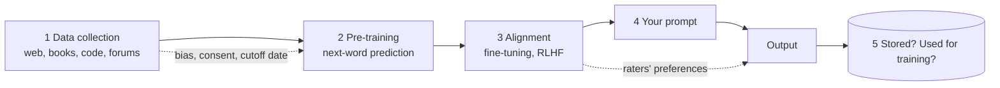

# Session 2: How a model is made, and what that means for your data

**Topic area:** Mental Models · Ethics, Policy and Regulations · **Duration:** 90 min (45 presentation + 45 activities) · **ILOs:** MM02, EPR02, EPR03, MM07, MM08

## Learning outcomes for this session

| ID | Outcome (exact wording) |
|----|-------------------------|
| MM02 | explain, in high-level terms, the GenAI model development process, including data collection, pre-training, and alignment methods such as fine-tuning and RLHF, as well as limitations associated with these processes (e.g., biases related with data collection, dataset cutoff dates). |
| EPR02 | identify data sources used to train GenAI models and describe how training data quality, consent, and representation shape GenAI model behaviors. |
| EPR03 | evaluate data management in GenAI systems in order to identify risks of misuse, manipulation, and threats to data sovereignty. |
| MM07 | articulate what explainability means in AI (i.e., XAI) and how it can improve user's trust when dealing with AI systems. |
| MM08 | discuss the limitations of explainability in GenAI, including why outputs can be difficult to interpret, and identify strategies to assess the model's responses (e.g., fact-checking against trusted sources and cross-checking outputs with alternative prompts) despite limited transparency. |

## Timeline

| Time | Block | Type | Notes |
|------|-------|------|-------|
| 0:00–0:05 | Recap: your outputs from session 1 | Opening | |
| 0:05–0:20 | From a pile of text to a polite assistant | Presentation | MM02, EPR02 |
| 0:20–1:05 | Activity: AI Model Pipeline (LA15, adapted for online) | Activity | MM02, EPR03. Breakout rooms of 5 |
| 1:05–1:25 | Can it explain itself? Explainability and its limits | Presentation | MM07, MM08 |
| 1:25–1:30 | Day 1 quiz and close | Closing | Formative quiz Q1–Q10 as a live poll |

## Presentation

### Slide outline

**Opening (0:00–0:05)**
- Show two or three of yesterday's group outputs. "Your models were trained on one page. Real ones are trained on most of the public internet. Same idea, different scale."
- Question for today: how do you get from that to something that answers politely and refuses some requests? And where does your data go when you type into it?

**From a pile of text to a polite assistant (0:05–0:20)** — MM02, EPR02
- Stage 1, **data collection**: web pages, books, code repositories, forums, subtitles, Wikipedia. Scraped at scale. Ask: "Is your writing on the internet anywhere? Then it may be in there."
- Quality, consent, representation: who is over-represented in internet text (English, certain countries, certain forums) and who is barely there. What the model learns follows from this.
- **Cutoff date**: the text stops at some point. The model does not know what happened after.
- Stage 2, **pre-training**: the next-word game from session 1, run over all that text for months on thousands of chips. The result is a "base model" that continues text but does not behave like an assistant.
- Stage 3, **alignment**: fine-tuning on examples of good answers; then **RLHF**, where human raters compare answers and the model is nudged toward the preferred ones. This is where "politeness" and refusals come from. And also where the raters' preferences and blind spots come in.
- Stage 4, **your prompt and the output**. Stage 5, **what happens to your prompt afterwards**: stored? used for training? where? `[figure: the five-stage pipeline from the handout]`
- Hand over: "In your rooms you will take this pipeline apart stage by stage and find the risks."

**Explainability and its limits (1:05–1:25)** — MM07, MM08
- A small example first: a spam filter built as a decision tree. "Is it from someone you know? Is it selling something?" You can read the rule and see why it decided. That is an **explainable** system. `[figure: a two-level yes/no decision tree for email types]`
- Why explanations matter: they let you catch a wrong decision, contest it, and decide how far to trust the system. Trust that is earned by seeing the reasoning, not by a confident tone.
- Now a chat model: billions of numbers, no rule you can read. When you ask "why did you say that?", it generates a plausible-sounding explanation with the same next-word process. The explanation is itself an output, not a look inside.
- So what can you do? Strategies that work without transparency: **check against a trusted source**; **ask the same question a different way and compare**; **ask for the source and verify it exists**; **test it** (for code: run it). Preview: session 3 puts these into practice.
- Ask the room: "Would you trust a marker who could not explain your grade? What would you do instead?"

**Closing (1:25–1:30)**
- Day 1 quiz: ten quick poll questions (`assessment/formative-checks.md`, Q1–Q10). Show the answers as you go; this is for them, not for marks.
- Before day 2: create a free account on one chat tool (ChatGPT, Gemini, Claude or Copilot), or pair up with someone who has one. Tomorrow you will use it.

### Speaker notes

**Opening.** Reuse yesterday's material rather than a fresh slide; continuity helps a class that is new to the topic. Keep it to five minutes.

**Pipeline (MM02, EPR02).** This is a story with five stages; tell it as a story. The key teaching move for EPR02 is the moment students realise the training data includes text written by people who were never asked. Use a concrete example: a forum thread, a personal blog, code someone pushed to a public repository. On representation, a simple line: "if the internet is mostly in English, the model is mostly good in English". For RLHF, avoid the maths entirely; say "human raters picked the better of two answers, thousands of times, and the model learned to produce what they preferred". Then ask who the raters were and what they might have missed. Misconception to address: that the model is "updated live from the internet". It is not; the cutoff date is fixed until a new version is trained. This block is the prerequisite for the activity, so make sure every stage name is on a slide the rooms can refer to.

**Explainability (MM07, MM08).** Start with the decision tree because students can see all of it; it takes the fear out of the word "explainability". The contrast with the chat model is the whole point: one you can inspect, the other you cannot. The most important sentence in the block is "when you ask it why, it makes up a why". Then move quickly to what students can actually do, because the strategies (check a source, re-ask, verify the source exists, run the code) are what they will practise tomorrow. Common misconception: that a confident, detailed answer is more likely correct. Say that fluency is not evidence.

**Closing.** Run the quiz as a poll, one question per screen, reveal the answer each time and give a one-line reason. Do not skip the account reminder; without accounts, session 3's activity stalls.

## Activities

### Activity: AI Model Pipeline — *LA15* (45 min)
**Source:** learning-activities/activities/15-ai-model-pipeline.md · **ILOs:** MM02, EPR03 · **Adaptation:** moved online: the paper worksheet becomes one shared document per breakout room, prepared from the student handout. Duration unchanged (45 min). The source's formative assessment (reflections and observations) is kept: each room's completed worksheet is its submission.

**Setup** — 10 breakout rooms of 5. One shared document per room containing the pipeline diagram, the shuffled stage descriptions, the list of risks, and the reflection prompts (all in `student-handouts/la15-model-pipeline.md`). No AI tool needed.

**Figure**

*Five stages from internet text to your answer, and the risks that ride along with each.*

**Steps** (student-facing, from the handout)
1. *(0–10 min)* **Match.** The document lists the five pipeline stages and, in a scrambled order, five short descriptions. Drag or number each description to its stage.
2. *(10–25 min)* **Find the risks.** Below is a list of ten risks (biased data, dataset cutoff date, bias in human feedback, disclosure of sensitive information in prompts, misleading outputs, unclear data-retention practices, loss of control over where data is stored, text used without consent, manipulation of outputs by poisoning training data, outputs that break local rules). Place each risk at the stage where it enters the pipeline. Some belong to more than one stage; pick the main one and note the second.
3. *(25–35 min)* **Explain the process in order.** In two or three sentences per stage, write how a model is developed, and for two stages give an example of how a decision made there changes what comes out at the end.
4. *(35–45 min)* **Who is responsible?** For three risks of your choice, answer: who can prevent this (the company, the raters, the regulator, the user, you)? Who is affected if it goes wrong? What would you want to know before typing something personal into the tool? Write your answers in the document; they are your room's submission.

**Debrief** — held at the start of the explainability block if time is tight, otherwise as step 5 in the main room:
- Which risk was hardest to place? (Usually "misleading outputs": it is produced at stage 4 but caused at stages 1–3.) → MM02: decisions early in the pipeline shape later output.
- Where does *your* data enter, and where might it end up? Who decides that? → EPR03: data control, retention, sovereignty (which country's law applies to a server you cannot see).
- If someone deliberately posted thousands of false web pages to change what a future model says, which stage did they attack? → EPR03: manipulation.
- What the instructor should draw out: responsibility is spread across the pipeline, and "the user" is one of the parties. That sets up the responsible-use plan in session 4.

## Assessment in this session

- Built-in formative check: each room's completed pipeline worksheet (LA15 source assessment), covering MM02 and EPR03.
- Day 1 quiz (`assessment/formative-checks.md`, Q1–Q10) in the closing block covers MM01, MM02, MM03, MM05, MM07, MM08, EPR02, EPR03.

## Homework / preparation for next session

No study homework. One practical task: create a free account on one chat tool (ChatGPT, Gemini, Claude or Copilot) before session 3, or arrange to share a screen with someone who has one. Estimated 5 minutes.

## Instructor notes

- **Timing risk:** step 2 (placing risks). At 25 minutes call time and move rooms to step 3 with what they have.
- **If running long:** drop step 3's second example, and fold the debrief into the first slide of the explainability block. **If running short:** ask two rooms to compare their "who is responsible" answers live.
- **Quiz logistics:** have the ten poll questions loaded before the session starts; five minutes is enough only if they are ready.
- **Tech:** breakout rooms and one shared document per room. No AI accounts needed in this session.
