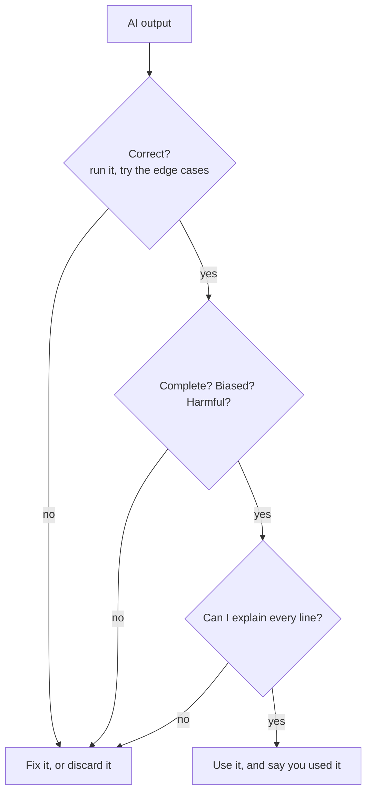
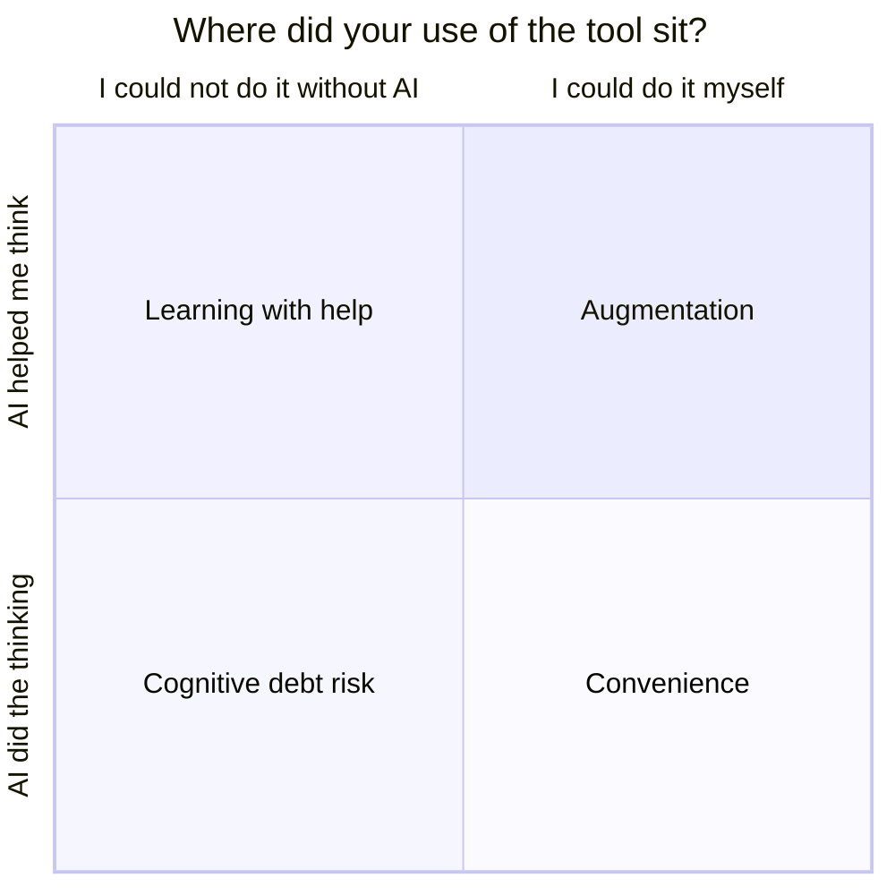

# Session 3: Where outputs go wrong, and how to use AI without losing your skills

**Topic area:** Mental Models · Ethics, Policy and Regulations · **Duration:** 90 min (40 presentation + 50 activities) · **ILOs:** MM04, MM06, EPR04, EPR05, EPR06, EPR07, EPR08

## Learning outcomes for this session

| ID | Outcome (exact wording) |
|----|-------------------------|
| MM04 | identify potential GenAI use cases, such as summarisation, augmented reasoning, generating content, evaluating content, ideation, and role playing, whilst recognising that these systems might make occasional mistakes. |
| MM06 | evaluate whether GenAI is appropriate for use in specific scenarios, based on ethical, practical, and task-related considerations. |
| EPR04 | explain the shortcomings of GenAI outputs (e.g. accuracy, reliability) and recognise the need to follow the appropriate policies and regulations within the context where the outputs will be used. |
| EPR05 | recognize limitations in GenAI model outputs, including hallucination, misinformation, privacy leakage, harmful content, in the context of societal impacts. |
| EPR06 | differentiate between reliable, trustworthy, and responsible GenAI systems. |
| EPR07 | identify tools and procedures for evaluating and verifying model outputs, and apply these to assess AI-generated content. |
| EPR08 | explain how overreliance on GenAI can lead to cognitive debt. |

## Timeline

| Time | Block | Type | Notes |
|------|-------|------|-------|
| 0:00–0:05 | Welcome back, account check | Opening | Poll: "Do you have a chat tool open and logged in?" |
| 0:05–0:17 | When the output is wrong: hallucination, misinformation, leaks, harm | Presentation | EPR04, EPR05 |
| 0:17–0:30 | What it is good for, and how to check it | Presentation | MM04, EPR07, EPR06 |
| 0:30–1:05 | Activity: AI Use Case Analysis (LA13, condensed to one use case) | Activity | MM04, MM06. Pairs in breakout rooms, then whole class |
| 1:05–1:10 | Cognitive debt in five minutes | Presentation | EPR08 |
| 1:10–1:25 | Activity: Personal AI Use Reflection, assignment variant (LA12, adapted) | Activity | EPR08. Breakout rooms of 5 |
| 1:25–1:30 | Wrap-up and bridge to session 4 | Closing | |

## Presentation

### Slide outline

**Opening (0:00–0:05)**
- Poll: logged in to a chat tool? Pair anyone without one with someone who has.
- Today's question: "It can write code for you. Should you let it?"

**When the output is wrong (0:05–0:17)** — EPR04, EPR05
- Recap the mechanism in one line: likely words, not true words.
- **Hallucination**: invented facts, invented references, invented functions in a library. Example: ask for a Python function that uses a made-up module and watch it comply. `[figure: a screenshot-style mock of a confident, wrong answer]`
- **Misinformation at scale**: the same error repeated to millions of people, in a fluent voice.
- **Privacy leakage**: what you paste in may be stored (session 2), and models have reproduced personal data from training text.
- **Harmful content**: alignment reduces it, but does not remove it; and "harm" includes bad advice to someone who trusts it.
- Reliability is not visible in the text. A wrong answer and a right one look the same.
- Therefore: the context decides what is acceptable. Wrong in a brainstorm is cheap; wrong in a medical summary, a legal filing, or your submitted coursework is not. That is why rules exist about where GenAI output can be used, and why you must know the rules for your context.

**What it is good for, and how to check it (0:17–0:30)** — MM04, EPR07, EPR06
- Use cases that work well: summarising a text you already have; explaining a concept a second way; generating first drafts and options (ideation); playing a role (a customer, an interviewer); evaluating or critiquing something you wrote; helping you reason through a problem step by step. Each with the caveat: occasional mistakes.
- A verification toolkit you can use today: (1) **test it** (run the code, try the edge cases); (2) **check against a trusted source** (documentation, textbook, official site); (3) **re-ask differently** and compare; (4) **ask for the source and confirm it exists**; (5) **ask a second tool**. `[figure: the "verify before you use it" flow from the handout]`
- Three words that are not the same: **reliable** (behaves consistently, gives the same quality every time), **trustworthy** (you have good reasons to rely on it for this task), **responsible** (someone is accountable for its effects and it is used within rules). A system can be reliable at being wrong.
- Hand over: "Now you will do a real task with a real tool, and check it."

**Cognitive debt (1:05–1:10)** — EPR08
- Debt: getting something now and paying later. **Cognitive debt**: letting the tool do the thinking now, and finding later that you cannot do it yourself.
- Two kinds of use: **augmentation** (the tool helped you think; you understand more afterwards) and **substitution** (the tool did it; you understand the same or less).
- In CS1 specifically: submitted code you cannot explain is debt with interest. Exams, interviews and debugging at 2 am all collect on it.
- Hand over: "Look at what you just did with the tool, and sort it."

**Closing (1:25–1:30)**
- Collect the patterns from the rooms; two or three countermeasures on screen (write first, then ask; explain the output in your own words; practise the skill you are losing).
- Next session: what it costs the world to run these tools, and the rules that apply to you.

### Speaker notes

**Wrong outputs (EPR04, EPR05).** Live demonstration beats slides here. Have a made-up module ready ("use the `fastsortx` library to sort this list") and show the tool inventing a plausible API. Then run it and show the error. That single demo carries hallucination and the "looks the same either way" point. For privacy leakage, refer back to the pipeline's stage 5 rather than re-teaching. For societal impact, one concrete example each of misinformation and harmful advice is enough; avoid a long catalogue. End on the "context decides" point, because EPR04 is about following the rules of the context where the output is used. Ask: "Where in your degree is a wrong answer cheap, and where is it expensive?"

**Use cases and verification (MM04, EPR07, EPR06).** Keep the use-case list positive and specific; students with little experience need to see that the tool is genuinely useful for some things, or the message becomes "never use it", which is not the goal. The verification toolkit should be on one slide they can keep open during the activity. On reliable/trustworthy/responsible, use the "reliable at being wrong" line: a tool that consistently produces plausible fake references is reliable, not trustworthy. Responsible adds accountability: who answers for the outcome. Misconception to address: that verification is a one-off. It is a habit.

**Cognitive debt (EPR08).** Five minutes, so one metaphor and one contrast. The calculator comparison is worth raising and then complicating: calculators replaced arithmetic after students had learned it, and the debt question is whether you learn the skill first. Point out that they just did a task where the tool could have replaced their thinking, and they are about to sort which parts it did.

**Closing.** Read out patterns from the rooms rather than presenting your own. Preview session 4 as "zooming out".

## Activities

### Activity: AI Use Case Analysis and Evaluation — *LA13* (35 min)
**Source:** learning-activities/activities/13-ai-use-case-analysis-and-evaluation.md · **ILOs:** MM04, MM06 (CS04a, CS04b are in the source but not selected for this course) · **Adaptation:** condensed from 2–4 use cases (20 min each) plus a 30-minute discussion to **one use case (20 min) plus a 15-minute discussion**, to fit the activity budget. The core mechanic (do a real task with a real tool, document observations against fixed criteria, discuss appropriateness) survives. Students work in pairs rather than individually so that one free account per pair suffices. Observations are collected in a shared class form or document rather than on paper. Prerequisites from the source (MM01, MM02, EPR05) have been taught in sessions 1–3.

**Setup** — Pairs in breakout rooms (25 rooms) or, if the platform limits rooms, rooms of 4 working as two pairs. Each pair needs one logged-in free chat tool (ChatGPT, Gemini, Claude or Copilot; any is fine, and different pairs using different tools makes the discussion richer). One shared class form or document with the observation questions from the handout. Students keep the verification toolkit slide open.

**Figure**

*Nothing goes into your work until it has passed every gate.*

**Steps** (student-facing, from the handout)
1. *(0–2 min)* **Policy check.** Before you start: this is a course exercise, so using the tool is allowed and expected. Note which tool you are using; you will report it. Do not paste anything personal into it.
2. *(2–12 min)* **The task.** Ask the tool: *"Write a Python function `is_leap_year(year)` that returns True if the year is a leap year and False otherwise. Then explain each line in one sentence."* Read the code and the explanation together. Then test it, by running it if one of you has Python set up, or by tracing it by hand, on these inputs: 2024, 2023, 1900, 2000. Write down what it returns for each and what it should return. (A leap year is divisible by 4, except years divisible by 100, unless also divisible by 400. So 2024 yes, 2023 no, 1900 no, 2000 yes.)
3. *(12–17 min)* **Push it.** Ask a follow-up: *"Are there any inputs where this function gives the wrong answer?"* Then ask the same question a different way, or ask a second tool. Do the answers agree?
4. *(17–20 min)* **Record your observations** in the class form: tool used; was the code correct on all four inputs; was the explanation correct and complete; anything invented, missing, or assumed; how much value the tool added compared with writing it yourselves; whether using the tool for this task was appropriate for a CS1 student, and why.
5. *(20–35 min)* **Whole-class discussion** in the main room.

**Debrief** — discussion points from the source, adapted:
- For which tasks in your studies is AI most useful? For which do ethical considerations matter most? Where did you see the best performance? → MM04, MM06
- How many pairs got a correct function on all four inputs? How many got a fully correct explanation? Did the tool admit any weakness when pushed, or did it make one up? → MM04 ("occasional mistakes")
- Same prompt, different tools, different pairs: how much did the outputs differ? → MM06, links to MM01 randomness
- Was it appropriate to use the tool here? What if the task were your graded assignment? What if you did not know what a leap year was? → MM06: task, practical and ethical considerations
- What the instructor should draw out: usefulness is real and task-dependent; appropriateness depends on whether you can still verify, and on whether you are supposed to be learning the thing the tool just did.

### Activity: Personal AI Use Reflection — *LA12* (15 min)
**Source:** learning-activities/activities/12-personal-ai-use-reflection.md · **ILOs:** EPR08 · **Adaptation:** the source's **assignment variant** is used: instead of a 20-minute pre-sessional inventory of a student's general AI habits (this course has no out-of-class time, and many students have little prior use to inventory), students reflect on the specific task they just completed in LA13. The in-class group discussion is kept at the source's 15 minutes. The pre-sessional worksheet is replaced by three questions answered individually in the first 4 minutes.

**Setup** — Breakout rooms of 5 (10 rooms). Each student has the handout's three questions; each room has the discussion prompt.

**Figure**

*Place the leap-year task on this chart. Which corner did you land in?*

**Steps** (student-facing, from the handout)
1. *(0–4 min, alone)* Think about the leap-year task. Answer for yourself: Which parts did the AI produce? Which parts do I fully understand? Could I write this function again tomorrow without AI? Sort your use into **augmentation** (it helped me understand) or **substitution** (it did it for me).
2. *(4–13 min, in your room)* Discuss: Where does cognitive debt build up fastest in a programming course? Which uses feel fine, and which feel harmful? Is some debt okay, in the way calculators made mental arithmetic optional? What is one habit that would keep the tool useful without letting it replace your learning?
3. *(13–15 min)* Post one pattern and one countermeasure from your room in the class chat.

**Debrief** — in the closing block: the instructor reads the chat, groups the patterns, and highlights countermeasures from the source (write a first draft or first attempt without AI; explain the AI's output in your own words before using it; deliberately practise the skills you notice yourself skipping). → EPR08

## Assessment in this session

- Day 2 quiz (`assessment/formative-checks.md`, Q11–Q18), run at the end of session 4, covers MM04, EPR04, EPR05, EPR06, EPR07.
- Reflection items R1 (MM06) and R2 (EPR08) are embedded in the LA13 observation form and the LA12 individual step respectively.

## Homework / preparation for next session

None.

## Instructor notes

- **Accounts are the risk.** Check in the opening poll. Anyone without an account joins a pair that has one. If the free tier is rate-limited for many students at once, allow pairs to use any of the four named tools and to swap if one stalls.
- **Timing:** LA13's step 2 can absorb time if pairs try to install Python. Say up front that tracing by hand is fine and expected.
- **If running long:** cut LA13's step 3 (push it) to a single follow-up question, and shorten the whole-class discussion to 10 minutes. **If running short:** ask one pair to paste their function and walk the class through the 1900 case.
- **Tech:** breakout rooms sized for pairs, one shared class form or document for observations, one free chat tool per pair.
