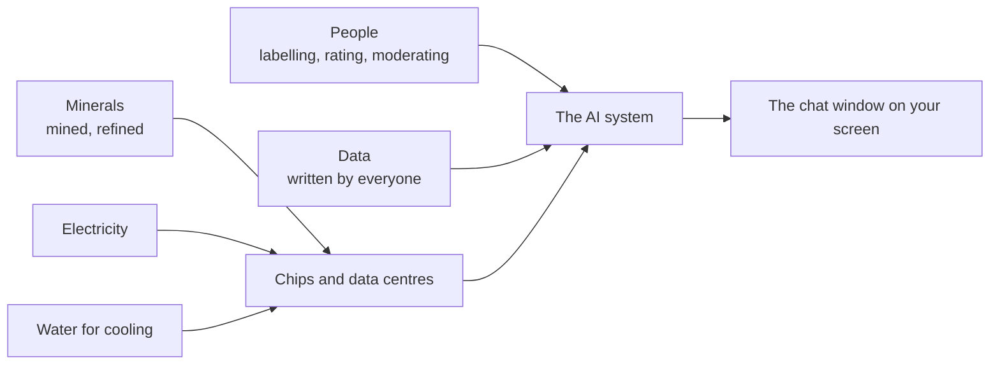

# Session 4: What it costs the world, and the rules that apply to you

**Topic area:** Ethics, Policy and Regulations · **Duration:** 90 min (50 presentation + 40 activities) · **ILOs:** EPR01, EPR09, EPR10, EPR11, EPR12, EPR13, EPR14

## Learning outcomes for this session

| ID | Outcome (exact wording) |
|----|-------------------------|
| EPR01 | understand the origins of resources (e.g. water, minerals, human labor) required to train, deploy, and host large-scale AI models |
| EPR09 | analyze the effects of GenAI automation on human labor, workplace expectations, and the labor market. |
| EPR10 | evaluate (the use of) GenAI systems against relevant normative principles (e.g., fairness, transparency, accountability, safety, robustness, and human governance). |
| EPR11 | design a plan for the responsible and context-appropriate use of GenAI, including documenting of GenAI-related outputs and decisions |
| EPR12 | identify and interpret relevant GenAI policies, assessing their applicability to and impacts on GenAI use in different contexts. |
| EPR13 | discuss societal perceptions of and expectations around GenAI use, taking into consideration power dynamics in the adoption of GenAI tools. |
| EPR14 | discuss frameworks for the fair and responsible use of GenAI in the student's particular discipline. |

## Timeline

| Time | Block | Type | Notes |
|------|-------|------|-------|
| 0:00–0:05 | Welcome back, where we are | Opening | |
| 0:05–0:15 | What is an AI system made of? Minerals, water, electricity, people | Presentation | EPR01 |
| 0:15–0:55 | Activity: Anatomy of (Another) AI System (LA08, condensed and online) | Activity | EPR01, EPR09. Breakout rooms of 5 |
| 0:55–1:15 | Principles, policies, and your discipline | Presentation | EPR10, EPR12, EPR13, EPR14 |
| 1:15–1:25 | Your responsible-use plan | Presentation (guided writing) | EPR11 |
| 1:25–1:30 | Day 2 quiz and close | Closing | Formative quiz Q11–Q18 as a live poll; reflection R3–R6 in chat |

## Presentation

### Slide outline

**Opening (0:00–0:05)**
- Where we have been: how it writes, how it is made, where it goes wrong, what it does to your learning. Today: zoom out to the world, then zoom in to the rules that apply to you.

**What is an AI system made of? (0:05–0:15)** — EPR01
- A chat window looks weightless. Behind it: **data centres** full of specialised chips; **minerals** mined to make them (and where they are mined); **electricity** to train and to answer every query; **water** to cool the machines; **people** who label data, rate answers and moderate harmful content, often on low pay far from the companies' headquarters; and the **data** itself, written by billions of people (session 2).
- Where each comes from, in one line each. `[figure: a supply-chain sketch from mine to chat window, with a person at each stage]`
- Give one order-of-magnitude example each for electricity and water of training a large model, with its source on the slide, and say plainly that the exact numbers are contested and the trend is up.
- Hand over: "Your room will pick one real system and trace what it is made of."

**Principles, policies, and your discipline (0:55–1:15)** — EPR10, EPR12, EPR13, EPR14
- From "what it costs" to "what should we require". Six principles that appear in nearly every AI framework: **fairness, transparency, accountability, safety, robustness, human oversight**. One sentence and one example each. `[figure: the six principles as a ring around "a GenAI system"]`
- Quick exercise in the chat: rate the leap-year tool you used yesterday on transparency (1–5) and accountability (1–5). Compare.
- Where principles become rules: **regulation** (for example, risk-based AI laws that place stricter duties on high-risk uses), **institutional policy** (your university's rules on GenAI in coursework), **product terms** (what the tool's provider says it may do with your data). How to read any of them: who does it apply to, what does it allow, forbid and require, and what happens if you break it.
- Who writes these rules, and who is left out. Students, gig workers who label data, people whose text was scraped: usually not at the table. Expectations differ: employers may expect you to use AI to be faster; teachers may forbid it so that you learn; peers may judge you for using it or for not. Power shapes adoption.
- Your discipline: computing. Frameworks for responsible use in software work tend to agree on: you are responsible for code you ship, whoever wrote it; disclose AI use where it matters; do not paste secrets or personal data into tools; verify before you merge. Point to your institution's or professional body's code of conduct as the place these live.

**Your responsible-use plan (1:15–1:25)** — EPR11
- Guided writing, individually, in a personal document. Five prompts on screen, two minutes each: (1) For which tasks in my studies will I use GenAI, and for which will I not? (2) How will I verify what it gives me? (3) How will I record what I used it for (tool, date, what I asked, what I kept)? (4) What will I never paste into it? (5) Which rule from my institution applies, and where will I find it?
- Say: this is the document you will be glad to have when a teacher, an employer or your future self asks "how did you make this?".

**Closing (1:25–1:30)**
- Day 2 quiz: eight poll questions (`assessment/formative-checks.md`, Q11–Q18), answers revealed as you go.
- Reflection in the chat, one line each: "One rule I would add to my university's GenAI policy if I had written it".
- Thank them. Point to the overview for the reading and to their plan as the thing to keep.

### Speaker notes

**Resources (EPR01).** This is the prerequisite the source activity asks for: a discussion of the types of resources and the costs of extracting them. Keep it structural: for each of minerals, electricity, water, labour and data, say where it comes from and who bears the cost. Use at most two numbers and put their sources on the slide; students will need to find their own in the activity, and modelling "number plus source" here sets the standard. The labour point deserves care: the people who make these systems safe by reviewing the worst content are real and often invisible, and this connects to EPR09 in the activity's debrief.

**Principles and policies (EPR10, EPR12, EPR13, EPR14).** Twenty minutes for four outcomes, so each gets one move. EPR10: the six principles, made concrete by rating yesterday's tool. EPR12: the three levels of rules and the four questions to ask of any policy; if your institution has a policy, show its actual text here (and ask `revise-course` to attach it so the course quotes it). EPR13: the "who wrote it, who was left out" question, and the observation that expectations pull in different directions depending on who has power over you. EPR14: bring it home to computing, where "you are responsible for what you ship" is the discipline's own norm and pre-dates GenAI. Misconception to address: that policies are only about cheating. They are also about data, safety and accountability.

**Plan (EPR11).** This is quiet individual writing; resist filling the silence. Model one answer briefly ("I will use it to get a second explanation of a concept, never to write code I have to submit before I have tried myself"). The documentation prompt matters most: a habit of logging tool, date, prompt and what was kept is what "documenting GenAI-related outputs and decisions" means in practice.

**Closing.** Run the quiz fast. The chat reflection gives you EPR13 evidence and a good last note.

## Activities

### Activity: Anatomy of (Another) AI System — *LA08* (40 min)
**Source:** learning-activities/activities/08-anatomy-of-another-ai-system.md · **ILOs:** EPR01, EPR09 · **Adaptation:** condensed from 60 to 40 minutes (research 20 min, summary 5 min, share and discussion 15 min) and moved online: poster paper and markers become one shared slide or document per room with a fixed four-box template. The core mechanic (research a real system's material, labour and data demands from public sources, estimate at least one quantity, relate findings in a whole-class discussion) survives. The source's formative assessment (depth and specificity of research, connections to earlier discussion) is kept.

**Setup** — 10 breakout rooms of 5. Each room is assigned one real system (two rooms per system): a chat assistant such as ChatGPT; an image generator; a self-driving car; a streaming recommendation system; a voice assistant. Each room has one shared slide or document with four boxes (Materials and energy · Water · People · Data) plus one line "Our number and its source". Students use their browsers for public sources (news, company reports, academic summaries); a chat tool may be used to find leads but every figure must be traced to a non-AI source.

**Figure**

*Everything on the left is invisible from the right. Your job is to make it visible for one system.*

**Steps** (student-facing, from the handout)
1. *(0–2 min)* Note your assigned system and open your room's slide.
2. *(2–22 min)* **Research.** Divide the four boxes among you. For each box find one or two concrete facts from a public source: what is needed, roughly how much, and where it comes from. Aim for at least one number in the whole slide (for example: energy to train one model, water per data centre per day, number of people employed to label data, number of documents in the training set). Write the source next to each fact. If you use a chat tool to get started, treat its answer as a lead, not a fact: find the original.
3. *(22–27 min)* **Summarise.** Agree on your room's single most surprising fact and your one number, and put them at the top of the slide.
4. *(27–42 min)* **Share and discuss** in the main room: one room per system presents for two minutes; the other room for that system adds anything different in the chat.

**Debrief** — from the source's closing discussion, extended for EPR09:
- Add up what the five systems need. What happens to those demands as more of the world uses AI every day? → EPR01
- Who did the human work behind your system? Where were they, what were they paid, and would you do that job? → EPR01 (labour), EPR09
- The systems you traced also *do* work that people used to do. Which jobs change? For computing specifically: if a tool writes routine code, what does a junior developer get hired to do, and what will employers expect you to know on day one? → EPR09
- Whose expectations count? The employer who wants speed, the teacher who wants you to learn, the workers whose jobs shift? → EPR09, bridge to EPR13 in the next block.
- What the instructor should draw out: the same growth in demand that strains resources also reshapes the job market these students are entering, and both are usually invisible from the chat window.

## Assessment in this session

- Built-in formative check: each room's completed four-box slide (LA08 source assessment: depth and specificity of research, connections to earlier discussion), covering EPR01 and EPR09.
- Day 2 quiz (`assessment/formative-checks.md`, Q11–Q18) in the closing block covers EPR01, EPR09, EPR12 alongside session 3's outcomes.
- Reflection items R3 (EPR10), R4 (EPR11), R5 (EPR13), R6 (EPR14): R4 is the responsible-use plan written in the 1:15 block; R3, R5 and R6 are chat reflections in the closing block and the principles block.

## Homework / preparation for next session

None. This is the final session. Students keep their responsible-use plan.

## Instructor notes

- **Timing risk:** research (step 2) always wants more time. Call two-minute warnings at 15 and 20 minutes. Rooms that have three boxes and a number are done enough.
- **Sources:** keep a short list of two or three reputable starting points per system ready to paste into the chat for rooms that stall. Insist on "number plus source"; a chat tool's figure without a traceable source does not count, which is itself a lesson from session 3.
- **If running long:** shorten the sharing to one room per system with no chat additions, and cut the plan-writing to three prompts (1, 2, 3). **If running short:** ask one room to compare the two orders of magnitude they found for the same quantity.
- **Tech:** breakout rooms, one shared slide or document per room, browsers. Chat tools optional.
