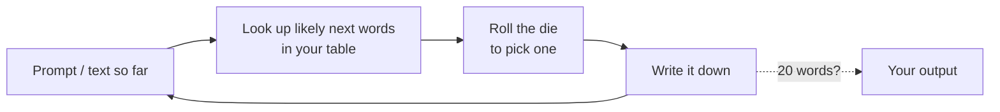

# Handout: Run a language model by hand

*Session 1 · Adapted from LA07 "Unplugged LLM Simulation" · 45 minutes · rooms of 5*

Today you are the model. You will learn from one page of text, then write new text one word at a time, using only what you learned and a die.

*You are the model: look up, roll, write, repeat.*

## What is in your room's document

- Your **training text**: one page on the topic "cats", in one genre (news report, children's story, forum post, encyclopedia entry or recipe blog). Other rooms have other genres.
- A **next-word table**: for each starting word in the left column, the words that follow it in your text, with counts. Six rows are done; four are blank.
- The **prompt**: the same for every room.
- Two empty **output** lines.

## Steps

**1. Read (5 min).** Read your training text once. What kind of text is it? Who wrote it, and for whom?

**2. Complete the table (15 min).** For each of the four blank starting words, scan your text and write down every word that comes right after it, with a count. Example row, from a made-up text:

| starting word | next words (count) | die faces |
|---|---|---|
| the | cat (3), mat (2), vet (1) | 1–3 cat · 4–5 mat · 6 vet |

Turn each row into die faces: the more often a word follows, the more faces it gets. If a word follows only once and you have six faces to give out, spread them roughly in proportion.

**3. Generate (15 min).** Start from the prompt: **The cat**. Look up the *last word you have* ("cat") in the left column. Roll the die (use any online die roller or the random function in a spreadsheet). Write the word the roll picks. Now look up *that* word, roll, write. Keep going until you have 20 words or the text stops making any sense. Then do it once more from the same prompt.

If a word is not in the table, that is your model being lost. Do what real models do: pick the most common word in your text and carry on.

**4. Share (5 min).** Paste both outputs into the class document under your genre.

**5. Compare (5 min, main room).** Listen to the other rooms' outputs.

## Think about

- Every room started from "The cat". Why is every output different? There are two reasons.
- Could you tell which genre a model was trained on just by reading its output?
- Whose words are in your training text? Did they agree to be there?
- What in your simulation stands for the "context" a real model uses? What stands for randomness?
- Did your model ever choose a word because it was *true*?
