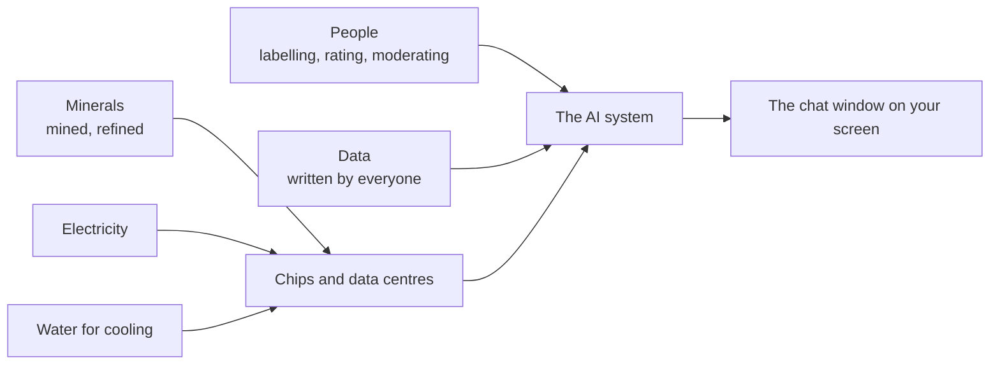

# Handout: What is your AI system made of?

*Session 4 · Adapted from LA08 "Anatomy of (Another) AI System" · 40 minutes · rooms of 5 · your completed slide is your room's submission*

Inspired by Kate Crawford and Vladan Joler's 2018 map *Anatomy of an AI System*, which traced everything behind a single smart speaker. You will do a small version for one real system.

*Everything on the left is invisible from the right. Your job is to make it visible for one system.*

## Your system

Your room has been assigned one of: a chat assistant such as ChatGPT · an image generator · a self-driving car · a streaming recommendation system · a voice assistant.

## Steps

**1. Set up (2 min).** Open your room's slide. It has four boxes and one line at the top.

**2. Research (20 min).** Split the boxes among you. For each, find one or two concrete facts from a public source (news reporting, company reports, academic summaries, reputable explainers): what is needed, roughly how much, where it comes from.

| Box | Questions to answer |
|---|---|
| Materials and energy | What hardware runs it? Which minerals go into that hardware, and where are they mined? How much electricity does training or running it take? |
| Water | Where are the data centres, and how much water do they use for cooling? Who else needs that water? |
| People | Who labelled the data, rated the answers, or moderated harmful content? Where are they, and what are they paid? |
| Data | What was it trained on? Who wrote that data, and were they asked? |

Aim for **at least one number** somewhere on the slide, with its source written next to it. If you use a chat tool to get started, treat its answer as a lead, not a fact: find the original source, or do not use the number.

**3. Summarise (5 min).** Agree on the single most surprising fact and your one number, and put them on the top line.

**4. Share (15 min, main room).** One room per system presents for two minutes. If you are the other room for that system, add anything different in the chat.

## Think about

- Add up what all five systems need. What happens as more of the world uses AI every day?
- Who did the human work behind your system? Would you do that job at that pay?
- Your system also *does* work people used to do. Which jobs change? If a tool writes routine code, what does a junior developer get hired to do?
- Whose expectations count: the employer who wants speed, the teacher who wants you to learn, the workers whose jobs shift?
