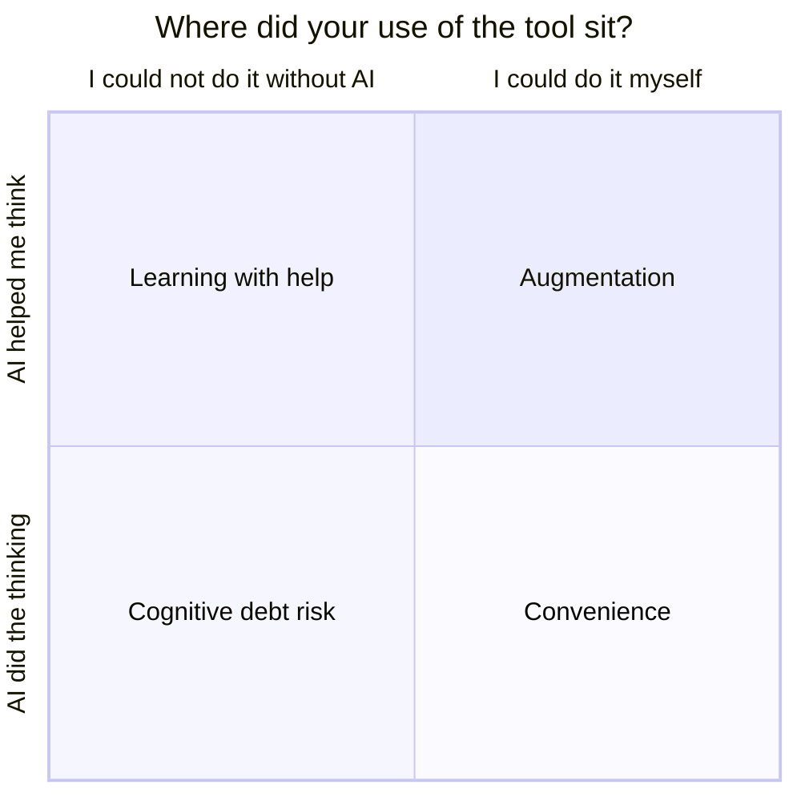

# Handout: What did the tool do, and what did you do?

*Session 3 · Adapted from LA12 "Personal AI Use Reflection" (assignment variant) · 15 minutes · alone, then rooms of 5*

*Place the leap-year task on this chart. Which corner did you land in?*

**Cognitive debt** is what builds up when a tool does your thinking now and you find later that you cannot do it yourself. **Augmentation** is when the tool helped you think and you understand more afterwards. **Substitution** is when it did the task and you understand the same or less.

## Alone (4 min)

Think about the leap-year task you just did.

1. Which parts did the AI produce? Which parts did you produce?
2. Which parts do you fully understand? Could you explain every line to a friend?
3. Could you write this function again tomorrow, without AI?
4. Was your use **augmentation** or **substitution**? Mark your spot on the chart.

## In your room (9 min)

- Where does cognitive debt build up fastest in a programming course?
- Which uses of AI feel fine, and which feel harmful?
- Is some debt okay, the way calculators made mental arithmetic optional? What is different about learning to program?
- What is one habit that keeps the tool useful without letting it replace your learning?

## Post to the class chat (2 min)

One pattern your room noticed, and one countermeasure.

Ideas from the source activity: write your first attempt without AI, then compare; explain the AI's output in your own words before using any of it; notice which skills you are skipping and practise them on purpose.
