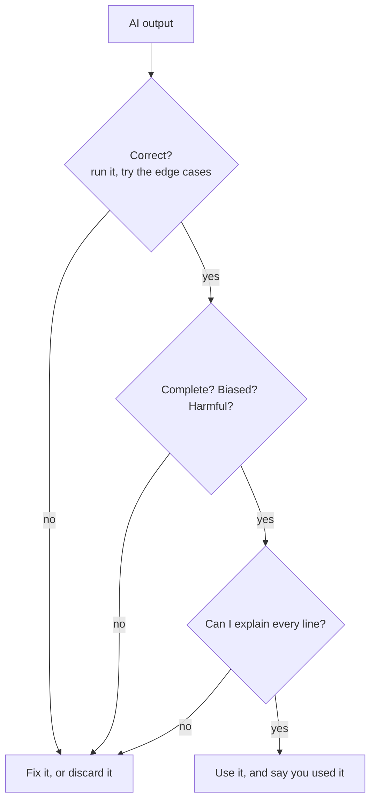

# Handout: Put a chat tool to work, then check it

*Session 3 · Adapted from LA13 "AI Use Case Analysis and Evaluation" · 35 minutes · pairs, then whole class*

You will do a real CS1 task with a free chat tool (ChatGPT, Gemini, Claude or Copilot; any one is fine) and then find out how good the result actually was.

*Nothing goes into your work until it has passed every gate.*

## Before you start (2 min)

This is a course exercise: using the tool is allowed and expected. Note which tool you are using. Do not paste anything personal into it.

## The task (10 min)

Type this into the tool:

> Write a Python function `is_leap_year(year)` that returns True if the year is a leap year and False otherwise. Then explain each line in one sentence.

Read the code and the explanation together. Then **test it** on these inputs. Run it if one of you has Python; otherwise trace it by hand, line by line.

| input | what the code returns | what it should return |
|---|---|---|
| 2024 | | True |
| 2023 | | False |
| 1900 | | False |
| 2000 | | True |

The rule: a year is a leap year if it is divisible by 4, except years divisible by 100, unless they are also divisible by 400.

## Push it (5 min)

Ask: *"Are there any inputs where this function gives the wrong answer?"* Then ask the same thing in different words, or ask a second tool. Do the answers agree with each other, and with your table?

## Record your observations (3 min)

Fill in the class form:

1. Tool used.
2. Was the code correct on all four inputs?
3. Was the explanation correct and complete? Did it invent, skip or assume anything?
4. How much did the tool add compared with writing it yourselves?
5. Was using the tool for this task appropriate for a CS1 student? One task-related reason, one practical reason, one ethical reason. Would your answer change if this were your graded assignment?

## Whole-class discussion (15 min)

Be ready to say: for which tasks in your studies is AI most useful? For which do ethical questions matter most? Where did you see the best performance, and the worst?
