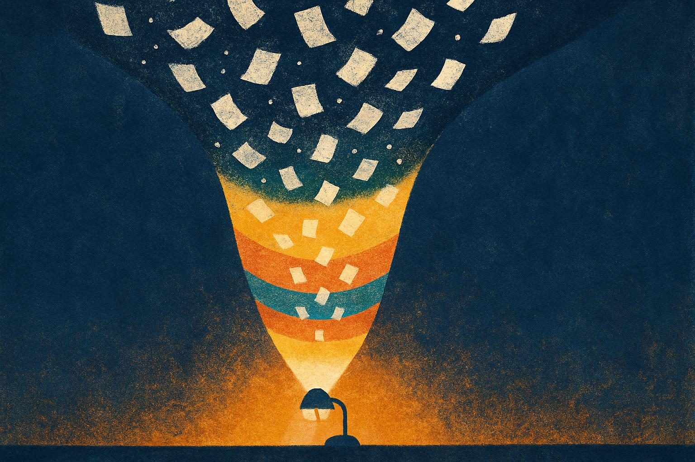
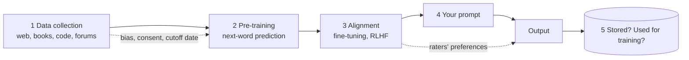

# Handout: Take the pipeline apart

*Session 2 · Adapted from LA15 "AI Model Pipeline" · 45 minutes · rooms of 5 · your completed document is your room's submission*

*Five stages from internet text to your answer, and the risks that ride along with each.*

## Step 1 — Match (10 min)

Number each description with the stage it belongs to (1–5).

| # | Description |
|---|---|
| | Human raters compare pairs of answers and the model is adjusted to produce the kind they prefer; the model also learns from examples of good assistant answers. |
| | Text is gathered at enormous scale from web pages, books, code repositories, forums and other public sources, up to a fixed date. |
| | You type text; the model predicts likely next words, one at a time, until it has an answer. |
| | The model plays the next-word game across all the collected text for weeks or months on thousands of chips, producing a "base model" that continues text but does not yet behave like an assistant. |
| | Your prompt and the answer may be kept by the provider, on servers in another country, and may be used to improve future models. |

## Step 2 — Find the risks (15 min)

Place each risk at the stage where it *enters* the pipeline (1–5). If it belongs to two stages, pick the main one and note the second.

| Risk | Stage(s) |
|---|---|
| Biased or unrepresentative data | |
| Dataset cutoff date (the model does not know recent events) | |
| Bias in the human feedback used for alignment | |
| Disclosure of sensitive information in a prompt | |
| Misleading or false outputs | |
| Unclear data-retention practices (how long is my prompt kept?) | |
| Loss of control over where data is stored, accessed or used (which country's law applies?) | |
| Text used without the author's consent | |
| Manipulation: someone plants false content so a future model repeats it | |
| Output that breaks the rules of the place where it is used (a course, a company, a country) | |

## Step 3 — Explain the process in order (10 min)

In two or three sentences per stage, write how a model is developed from stage 1 to stage 5. For **two** stages, give an example of how a decision made there changes what comes out at the end. (For instance: what happens to answers about a topic that was rare in the collected text? What happens if the raters in stage 3 all share the same view?)

## Step 4 — Who is responsible? (10 min)

Pick three risks from step 2. For each:

- Who can prevent it? (The company, the raters, a regulator, the user, you.)
- Who is affected if it goes wrong?
- What would you want to know before typing something personal into the tool?

Write your answers in the document. Be ready to share one.
